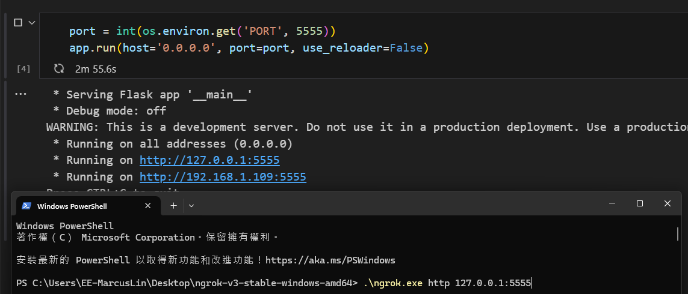

# Python Intro

- 語法簡潔、結構簡單，程式碼可讀性強，學習更加簡單
- 免費且開源，擁有豐富的開發者社群支援
- 完善的基礎程式庫
- 應用廣泛，能和大多數的程式語言共同使用

# Environment(Aanconda)

Anconda就像是 Python的懶人包，它內建了許多 Python的熱門套件，如此一來使用者就不用在安裝套件時面臨種種錯誤訊息與漫長的 debug過程 (尤其是在 windows作業系統下)。換句話說，能讓 coder不用花費心力在處理系統環境端的問題，而是能直接捲起袖子開始寫程式，進行現實問題的分析。不僅如此，他還有內建 Spyder IDE與 Jupyter Notebook，這兩個編譯器對於新手而言相對友善。

## 1. 安裝環節

請先去anaconda官方網站 

[https://www.anaconda.com/download](https://www.anaconda.com/download)

**<u>必須用有效的email認證</u>**


> **安裝時要注意以下這部分**
> 
> 注意安裝路徑稍後會用到
>  
>  
>
> 勾選1,3項
> 
> 
>
> 然後照著安裝步驟next下去

## 2. 如何使用

Anaconda擁有精美強大的GUI介面，操作簡便直覺

這邊講解Terminal的用法

1. 先設定環境變數


<span style="color:yellow">在編輯環境變數的地方輸入安裝anaconda的地方 + \condabin</span>


*在家目錄下面建立資料夾python_project並在該路徑開啟terminal*

``` powershell
conda env list
# 輸入該指令可看到只有一個環境叫做base這是anaconda預設的

conda create --name myenv python=3.11 # 這邊為環境命名為myenv並且版本為3.11
# 都照著系統提示走就對了(y/N)

# 啟動環境(左邊會出現目前環境名稱)
conda activate myenv

# 安裝我們需要的套件
pip install ipykernel jupyter

# 關閉環境
conda deactivate
```
# Lesson 1

開啟jupyter開發環境

``` powershell
jupyter notebook
# 通常會自動跳轉到網頁，如果沒有的話打開瀏覽器輸入localhost:8888
```
## demo a simple program

新增檔案


開發我們的第一支程式
```python
# First python program
demo = "Hello World!"
print(demo)
```


## 基礎觀念

- 型別
  - 字串(string)
  - 整數(int)
  - 浮點數(float)
  - 布林值(boolean) # python的布林值要首字要大寫
- 運算符號
  - 加減乘除(+,-,*,/)
  - 整數除法(//)
  - 餘數除法(%)
  - 次方(**)
- 比較運算子
  - <,>,<=,>=
  - 完全相同(==)
  - 不等於(!=)
- 邏輯運算子
  - 和(and, &)
  - 或(or, |)
  - 非(not)
  - 包含(in )
  - 判斷是否為同一物件(is)
- <span style="color:red">數組儲存</span>
  - 陣列(List)
    - 將一連串的元素放在一個序列中，使其都有各自的編號，放入的元素可以是字串、數字、布林、串列、字典...等基本元素
  - 字典(Dict)
    - 建立字典有兩種方法，建立時必須要包含「鍵 key」和「值 value」兩個項目，鍵在左側，值在右側。
  - 元組(Tuple)
    - 和List非常類似
    - tuple「只要建立了，就不能修改內容」
    - tuple 使用「小括號」，串列 list 使用「方括號」
    - 如果 tuple 裡只有一個元素，後方必須加上「逗號」
    - 讀取速度比List還要快
  - 集合(Set)
    - 集合由「數字、字串或布林」所組成，同一個集合裡的項目，可以是不同的型別
    - 如果建立時出現重複的項目，只會保留一個，如果是字典，只會保留鍵

# Lesson 2 條件判斷及重複迴圈
- 條件判斷
  - if,elif,else
- 重複迴圈
  - for,while

# Lesson 3 函數定義
- definition
  - 在 Python 裡，使用「def」定義一個函式，函式的命名規則和變數相同
  - 可以回傳多個值，或執行相關動作
- module
  - import 陳述式最簡單的用法就是「import 模組名稱」，模組名稱是不包含 .py 的名稱
  - 可以調用裡面的屬性和方法

# Lesson 4 物件導向(Object-Oriented Programming)
Python設計的方式就是將所有東西都當成一個物件 \
每個物件都有自己的屬性(propertites)和方法(methods) \
舉例來說 \
車子有自己的烤漆顏色、4 門或 5 門、車身的寬高、安全氣囊數量等等，這些是屬性；車子可以按下喇叭、煞車、轉彎、加速等，都是它的方法。
```python 
class Parent(): # 類別的命名都是駝峰命名法
  def __init__(self,name: str):
    self.name = name # 屬性
  def post(self): # 方法
    return f"我是{self.name}"

if __name__ == "__main__":
  obj = Parent("父親")
  print(obj.post())
```
## 繼承
物件導向的重要特性 \
子類別可以繼承父類別的屬性和方法 
  
# Case 1 Linebot機器人
**架構圖如下**


1. 首先下載ngrok(架構途中的webhook)
  - 用於將本地伺服器位址轉發至網際網路
  - 申請Authtoken
  - [下載](https://dashboard.ngrok.com/get-started/setup/windows)
  - 解壓縮並打開ngrok.exe
  - 輸入```ngrok config add-authtoken $YOUR_AUTHTOKEN```

2. 打開LINE Developers
  - [網址](https://developers.line.biz/en/)
  - 利用個人帳號註冊(註冊免費)
  - 在Console home新增一個provider
  - 在provider新增一個channel(類別為MessageAPI)
  - 將CHANNEL_SECRET & CHANNEL_ACCESS_TOKEN 複製

3. 撰寫server.ipynb
  - 首先進入虛擬環境
  - 在terminal上輸入```pip install flask line-bot-sdk```安裝我們需要的套件
  - 創建lineBot.ipynb和linebot_token.py
  - 程式撰寫

4. 將本地位址轉發到網際網路
  - 開啟linebot.ipynb的Flask app
  - 進入到ngrok解壓縮後的目錄下開啟terminal
  ```powershell
  .\ngrok.exe http "Flask轉發本地位址"
  # 會出現轉換到網際網路的位址，請複製他
  ```
  
  - 網址貼在LineDevelopers那個CHANNEL裡面，並在後面加上"/callback"
  

**可以掃描QRcode去跟機器人聊天及上傳圖片**


# Case 2 心靈雞湯產生器

首先請download文本集至專案目錄
> [data.json](https://raw.githubusercontent.com/StillFantastic/bullshit/master/generator/data.json)

1. 優先撰寫心靈雞湯的類別
   * 讀取文本
   * 解析文本
   * 產生對話
2. 撰寫用於建構及執行心靈雞湯這個類別的程式(main.py)


### 參考來源
[https://docs.python.org/3/tutorial/index.html](https://docs.python.org/3/tutorial/index.html)

[https://steam.oxxostudio.tw/category/python/index.html](https://steam.oxxostudio.tw/category/python/index.html)

[https://github.com/telunyang](https://github.com/telunyang)